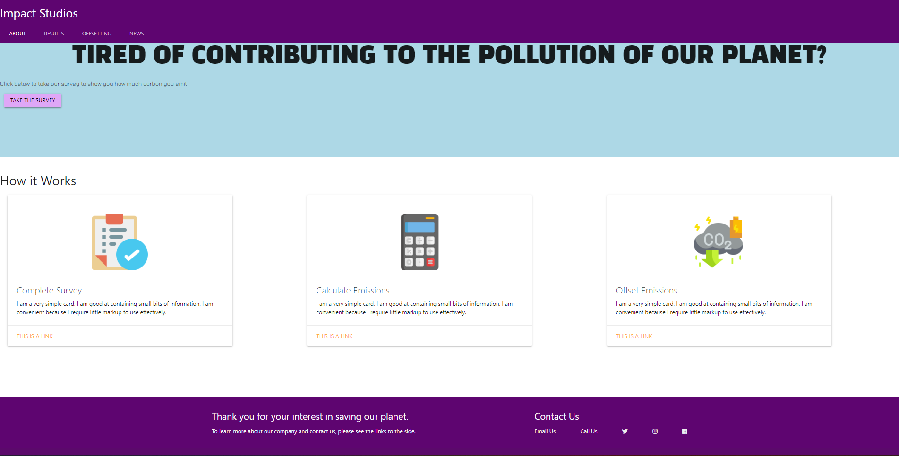
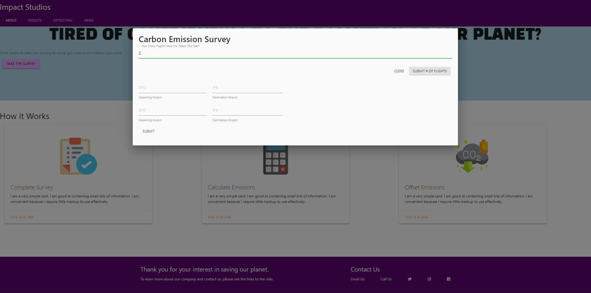
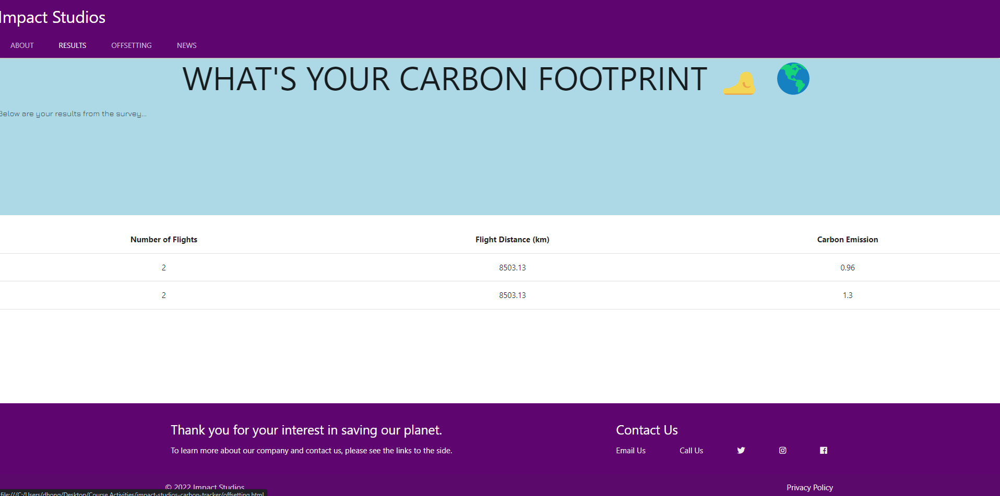
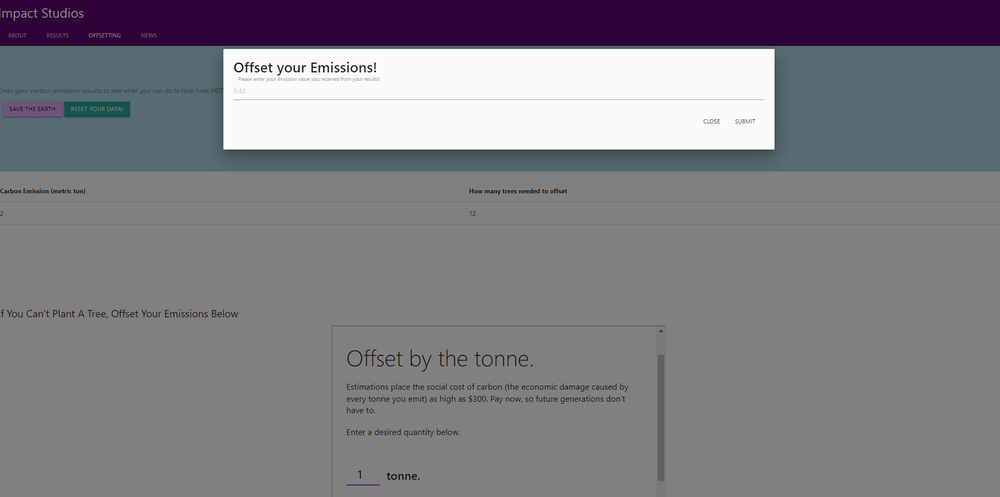
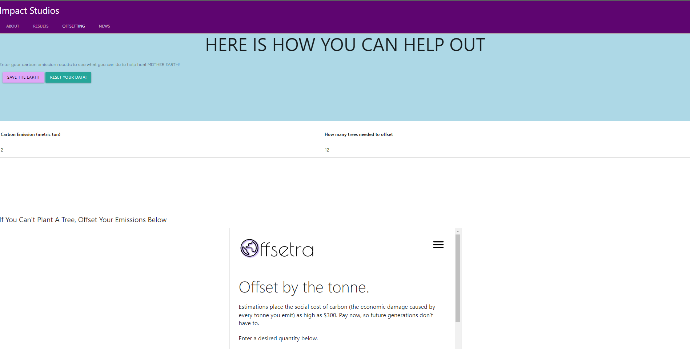
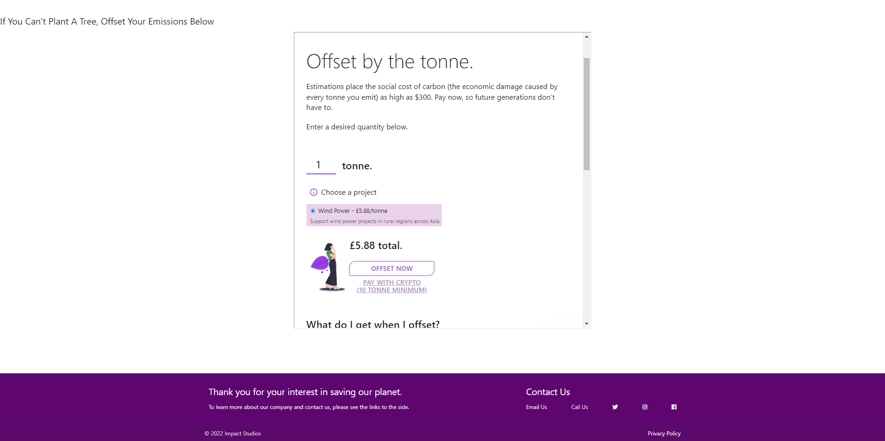
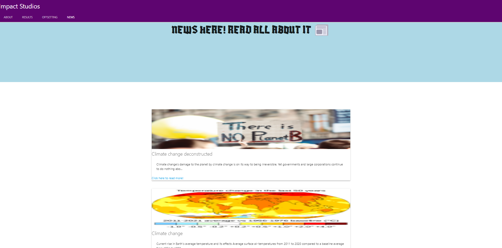

# Impact Studios: Carbon Tracker

## Description

As climate change concerns consistently becomes more prevalent to our everyday lives, we, the members of Impact Studios, created a web app(carbon tracker) that would help users understand how much carbon they are emitting throughout their every day lives.

For the initial development portion, we planned out a user story and targetted each and every element we could for the time being.

```
AS A USER I WANT TO UNDERSTAND MY EMISSIONS SO I CAN OFFSET THEM OR TAKE ACTION TO LIVE A MORE SUSTAINABLE LIFE
WHEN I INPUT MY AVERAGE YEARLY FLIGHTS I TOOK
THEN I CAN OBTAIN MY AVERAGE YEARLY CARBON EMISSIONS FROM FLIGHTS
WHEN I INPUT MY EMISSIONS IN THE MODAL
THEN I CAN OBTAIN HOW MANY TREES I MUST PLANT TO OFFSET MY EMISSION
IF I AM UNABLE TO PLANT
THEN I AM PRESENTED WITH A DIFFERENT OPTION TO HELP OFFSET MY EMISSION
WHEN I AM BROWSING THE SITE
THEN I AM PRESENTED WITH THE MOST UP TO DATE ARTICLES REGARDING CLIMATE CHANGE
```

For now, our application will only track a user's flight patterns. However, future development will consist of the following:

```
1. Allow users to track other methods of emission
    a. Motor Vehicle Commute
    b. Eletricity Use
    c. Cruises
2. Allow users to share their results via social media networks via a click of a button.
3. Create a community board for the users to post and discuss on certain topics
```

[Click here](https://lunirs.github.io/impact-studios-carbon-tracker/) to track your own emissions and make a difference!

## Installation

In order to build this application, we first had to find 2 APIs that would satisfy the user story.
For the emission values, we used the Carbon Interface API. for the News articles, we used TheNews API.
We obtained API keys from each API and wrote functions that used the data from the responses fetched from the APIs. The values we wanted were determined through our parameters.
Once everything was fetched and the responses came out good, we utilized the data to:

1. Obtain total carbon emissions in metric tons from the flights the users took
2. Obtain total flight distances from the flights the users took
3. Render resutls onto the results page
4. Obtain number of treeses needed to be planted to offset user's emission through form where user can input their results.
5. Obtain news articles and rendered them onto the page

In order to calculate the number of trees, we used the following formula:

```
var convertToTrees = (input) => {
  var numberOfTrees = ((input * 1000) / 167).toFixed(0);
  console.log(numberOfTrees);
  treeResults.push(numberOfTrees);
  setResults();
  return numberOfTrees;
};

```

On average, a mature free offsets about 167kg of carbon. So since the results are in metric tons, we would multiply that result by 1000 and then divide by 167 to receive the number of trees needed to be planted.

Overall, the user should have a smooth experience when traversing through our website.

## Usage

### Initial Page



### Modal for Inputs



### Results Page



### Offsetting Page Modal for Conversion Input



### Offsetting Page Conversion Results



### Offsetting Page for Other Methods to Offset



### News Page



## Credits

### Contributors:

1. [Saad Mian](https://github.com/SDMNNY)
2. [Elliot Waxman](https://github.com/elliotzacharywaxman)
3. [Daniel Hong](https://github.com/Lunirs)

### Resources used:

1. [Carbon Inteface API](https://docs.carboninterface.com/?ref=publicapis.dev#/)
2. [TheNews API](https://www.thenewsapi.com/documentation)
3. [AOS (animate on screen)](https://michalsnik.github.io/aos/)
4. [jQuery](https://jqueryui.com/)
5. [Materialize CSS](https://materializecss.com/)
6. [jQueryUI](https://api.jquery.com/)

## License

Copyright (c) [Impact Studios] [2022]
